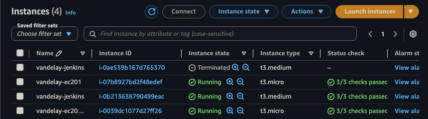
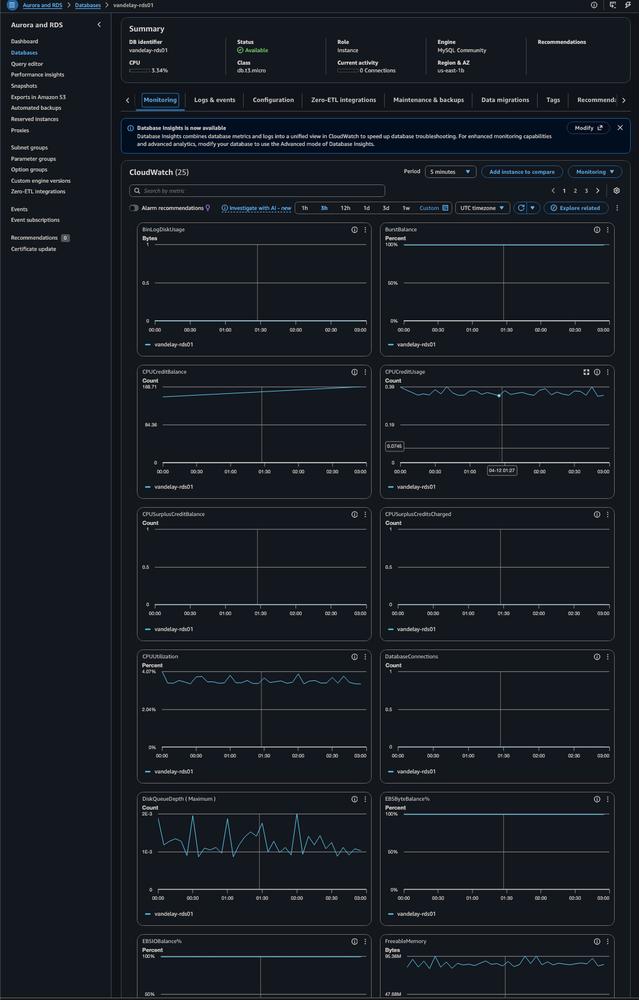
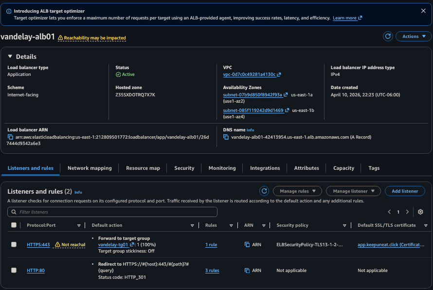
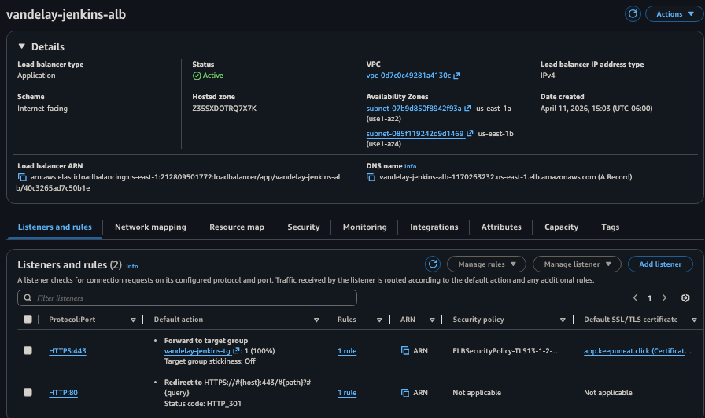
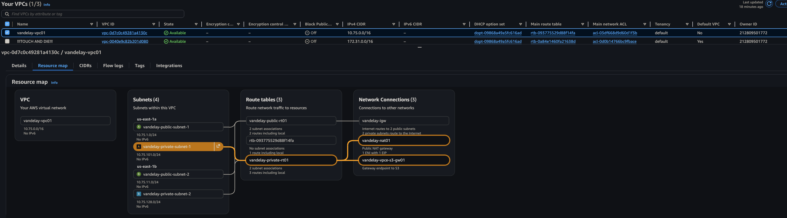

# Lab-2 Vandelay Infrastructure — Handoff Report

**Date:** 2026-04-11
**Status:** LIVE — Pipeline GREEN (Build #12)
**Jenkins:** https://jenkins.keepuneat.click
**Next Session:** Snyk DevSecOps Integration / Lab-3 Multi-Region work

---

## Build Status

[](https://jenkins.keepuneat.click/job/vandelay-lab2-pipeline/)
[](https://jenkins.keepuneat.click/job/vandelay-lab2-pipeline/)

---

## 1. What's Running Right Now

### Jenkins

| Resource | Value |
|---|---|
| Instance ID | `i-03cd85dba23e61e25` |
| Instance type | `t3.medium` |
| Access | https://jenkins.keepuneat.click (HTTPS via ALB) |
| Login | `ShogunnMaster` |
| Shell access | `aws ssm start-session --target i-03cd85dba23e61e25` |
| IAM role | `vandelay-jenkins-role` with `VandelayTerraformDeployPolicy` |

### Application Infrastructure (Terraform-managed)

| Resource | ID / Value | Notes |
|---|---|---|
| EC2 App Instance | `vandelay-ec201` | t3.micro, public subnet, IAM profile attached |
| EC2 IAM Profile | `vandelay-instance-profile01` → `vandelay-ec2-role01` | Secrets Manager + SSM access |
| RDS Instance | `vandelay-rds01` | MySQL, port 3306, `PubliclyAccessible=False` |
| Secret | `lab/rds/mysql` | RotationEnabled=True, Lambda attached |
| ALB | `vandelay-alb01` | Internet-facing, WAF attached |
| Jenkins ALB | `vandelay-jenkins-alb` | HTTPS 443 → Jenkins 8080 |
| CloudFront | `app.keepuneat.click` | HTTPS, WAF attached |
| WAF (regional) | `vandelay-waf01` | Attached to app ALB |
| WAF (CloudFront) | `vandelay-cf-waf01` | Attached to CloudFront distribution |
| Domain | `keepuneat.click` | Route53 hosted zone |
| VPC | `vpc-0d7c0c49281a4130c` | `vandelay-vpc01` — 10.75.0.0/16 |

### AWS Console Screenshots

#### EC2


#### RDS


#### Application ALB


#### Jenkins ALB


#### Security Groups — Jenkins Behind ALB Only


#### VPC Resource Map


---

## 2. S3 Buckets

| Bucket | Purpose | Notes |
|---|---|---|
| `class7-armagaggeon-tf-bucket` | Terraform remote state | `prevent_destroy` lifecycle — never delete manually |
| `vandelay-alb-logs-[ACCOUNT_ID]` | ALB access logs | `prevent_destroy` — import before each apply cycle |
| `vandelay-incident-reports-[ACCOUNT_ID]` | Lambda incident reporter output | `prevent_destroy` — import before each apply cycle |

> **Note:** Two S3 buckets include the AWS account ID in their name (by design — S3 global uniqueness). The account ID is intentionally redacted here with `[ACCOUNT_ID]`. Do not commit the raw account ID to public repos.

---

## 3. Persistent Resources — Import Required on Each Cycle

These resources survive `terraform destroy` due to `prevent_destroy` lifecycle. Before every `terraform apply` on a fresh state, run:

```bash
# S3 — ALB logs
terraform import 'aws_s3_bucket.vandelay_alb_logs[0]' vandelay-alb-logs-[ACCOUNT_ID]

# S3 — Incident reports
terraform import aws_s3_bucket.incident_reports vandelay-incident-reports-[ACCOUNT_ID]
```

Before `terraform destroy`, remove them from state first:
```bash
terraform state rm 'aws_s3_bucket.vandelay_alb_logs[0]'
terraform state rm aws_s3_bucket.incident_reports
terraform state rm aws_ebs_volume.vandelay_jenkins_data
```

---

## 4. Security Posture

| Control | Status |
|---|---|
| Jenkins port 8080 | Restricted to ALB SG only — not internet-reachable |
| Jenkins HTTPS | TLS 1.3 via ACM wildcard cert `*.keepuneat.click` |
| SSH port 22 | Removed from all security groups |
| Shell access | SSM Session Manager only |
| RDS | Not publicly accessible — SG-to-SG ingress only |
| Secrets | Secrets Manager with auto-rotation — no hardcoded passwords |
| WAF | Regional (ALB) + CloudFront scope — active on both ingress paths |
| IAM | Jenkins role scoped to lab resources — no AWS account root access |
| SNS email | Set via `TF_VAR_sns_email_endpoint` credential — not hardcoded in pipeline |
| DB password | Set via `TF_VAR_db_password` credential — not hardcoded anywhere |

### Security Scan Findings (2026-04-11)

| Severity | Location | Finding | Action |
|---|---|---|---|
| LOW | `variables.tf:94` | `gaijinmzungu@gmail.com` default for SNS endpoint | Intentional for lab — acceptable |
| LOW | `2026-04-05_HANDOFF_REPORT.md` | AWS account ID in S3 bucket names | Historical artifact — old file, not republished |
| LOW | `build17_console.txt`, `build18_console.txt` | AWS account ID in Terraform ARN log lines | Raw console logs — archived locally only, not tracked in git |
| INFO | `gate_secrets_and_role.json` | Account ID already redacted (`[ACCOUNT_ID]`) | Already clean |
| NONE | New reports (this session) | Account IDs, passwords, tokens | Not present |

---

## 5. Access Quick Reference

| Resource | URL / Command |
|---|---|
| App (CloudFront) | https://app.keepuneat.click/ |
| App health check | https://app.keepuneat.click/health |
| Jenkins UI | https://jenkins.keepuneat.click |
| Jenkins login | `ShogunnMaster` |
| EC2 SSM shell | `aws ssm start-session --target <ec2-instance-id>` |
| Jenkins SSM shell | `aws ssm start-session --target i-03cd85dba23e61e25` |
| TF state bucket | `s3://class7-armagaggeon-tf-bucket/class7/fineqts/armageddontf/state-key` |
| GitHub repo | https://github.com/NRD808Sequence/DevOps |

---

## 6. Known Issues / Action Items

| Item | Priority | Notes |
|---|---|---|
| Git installation warning in Jenkins | Low | `Selected Git installation does not exist` — cosmetic. Fix: Manage Jenkins → Tools → Git → add installation named `Default` pointing to `/usr/bin/git` |
| Smoke test URL | Low | Currently hits EC2 direct IP. Consider updating to `https://app.keepuneat.click` to test the full CloudFront + WAF path |
| Blue Ocean blank load | Resolved | Fixed by installing `blueocean` meta-plugin — replaces individual sub-plugins |
| Orphan VPC `vpc-0e050f5fa044e88db` | Resolved | 7 VPC endpoints deleted, VPC can now be deleted via console |
| SNS email subscription | Check | Confirm subscription confirmation clicked at `gaijinmzungu@gmail.com` — required for alert delivery |

---

## 7. Cost Estimate (Current Stack)

> AWS us-east-1 on-demand rates, 730 hrs/month.

| Resource | Qty | Monthly |
|---|---|---|
| EC2 t3.medium (Jenkins) | 1 | ~$30 |
| EC2 t3.micro (app) | 1–2 | ~$8–15 |
| Jenkins ALB | 1 | ~$6 |
| App ALB | 1 | ~$6 |
| RDS db.t3.micro | 1 | ~$15 |
| NAT Gateway | 1 | ~$33 |
| VPC Interface Endpoints (SSM, Secrets, KMS, etc.) | 7 | ~$51 |
| WAF WebACLs | 2 | ~$10 |
| CloudFront | 1 | ~$1 |
| EBS (Jenkins data 20GB + root vols) | — | ~$5 |
| Secrets Manager | 1 | ~$1 |
| S3 (all buckets) | — | ~$2 |
| **Total** | | **~$168–175/month** |

> **Stop instances between sessions** to save ~$75/month on EC2 + Jenkins costs.

---

## 8. Next Session Options

### Option A — Snyk DevSecOps Integration
Add Snyk SAST/SCA/IaC scanning stages to the Jenkins pipeline.

**Pre-work:**
- [ ] Create Snyk account at snyk.io (free tier)
- [ ] Get Snyk API token (Settings → API Token)
- [ ] Get Snyk org slug (visible in Snyk UI URL)
- [ ] Jenkins: Install **Snyk Security** plugin
- [ ] Add credentials: `snyk-api-token` (Snyk type), `snyk-api-token-string` (Secret Text), `snyk-org-slug` (Secret Text)

**Known gotcha — `command not found` on first run:**
Remove the CLI stage → run pipeline → plugin installs CLI → restore CLI stage → re-run.

### Option B — Lab-3 Multi-Region Work
Continue the Tokyo/São Paulo split-state refactor.
- CloudFront ID: `ELVLDX7GGGNGK`
- TGW: `tgw-07feaa8e04e3e5baf`
- See `lab-3/` directory for current state

### Option C — Pipeline Enhancements
- Add `Badge` plugin for per-gate inline badges in build history
- Add Slack/email notification stage
- Add `addBadge()` post-step to Gate Tests stage

---

## 9. Completed This Session (2026-04-11)

| Item | Status |
|---|---|
| Jenkins HTTPS via ALB + ACM wildcard cert (`jenkins.keepuneat.click`) | ✅ |
| Port 8080 restricted to ALB SG — no direct internet access | ✅ |
| Build #12 — clean idempotent SUCCESS, gates GREEN | ✅ |
| SNS subscription drift fixed — no more replacing on every build | ✅ |
| `cleanWs()` replaced with `rm -rf .terraform` (no ws-cleanup plugin needed) | ✅ |
| `timestamps()` option removed (Timestamper plugin not required) | ✅ |
| Orphan VPC `vpc-0e050f5fa044e88db` — 7 VPC endpoints deleted | ✅ |
| Anonymous `Job/Read` enabled — unprotected badge URL works | ✅ |
| Blue Ocean meta-plugin installed — `/blue` view loads correctly | ✅ |
| Security scan of deliverables — no new leaks in current reports | ✅ |
| Pipeline Report + Handoff Report written for gut check | ✅ |
