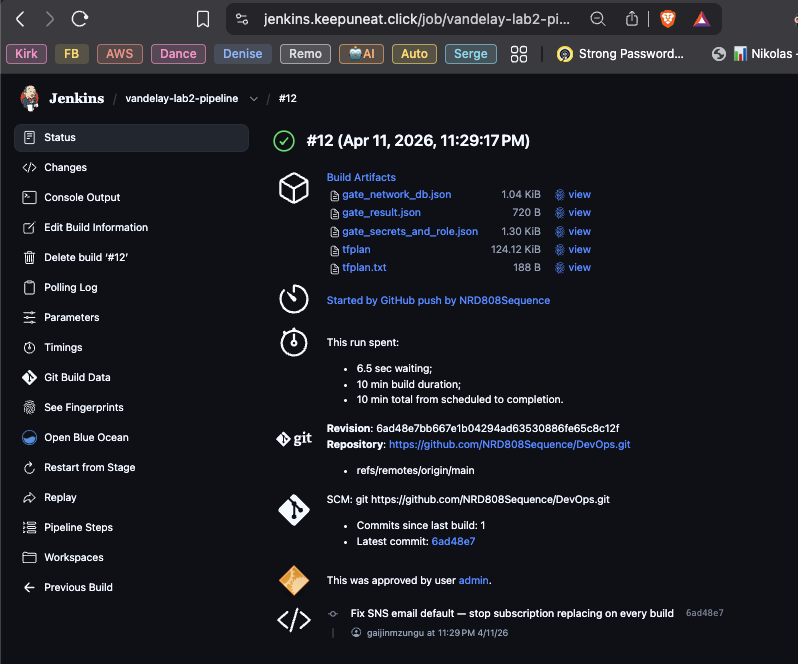
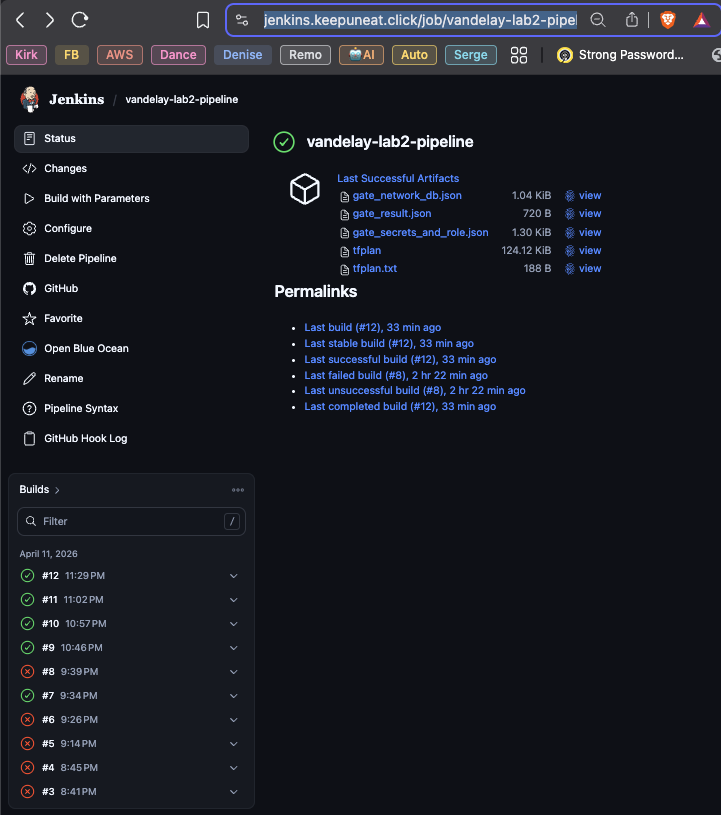
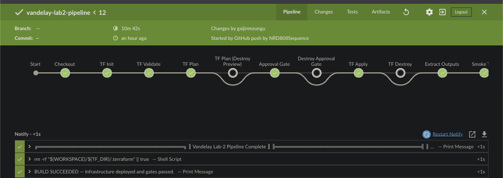
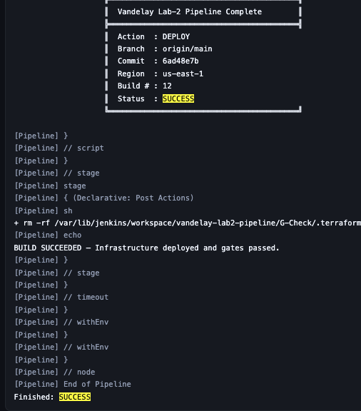
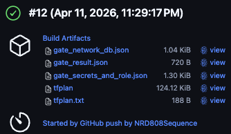
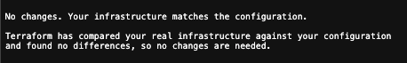
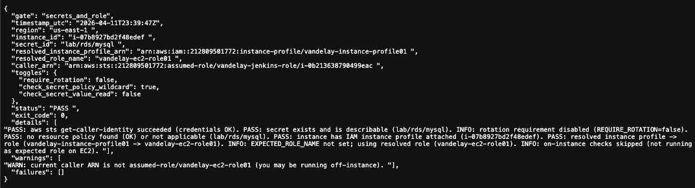
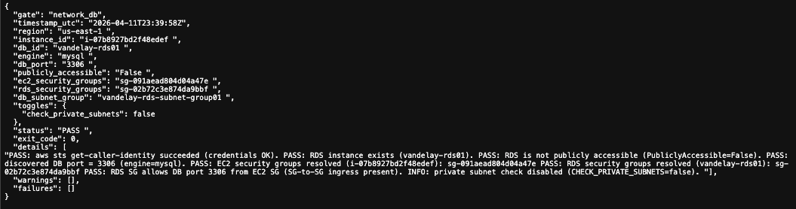
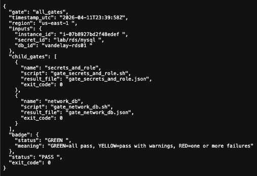
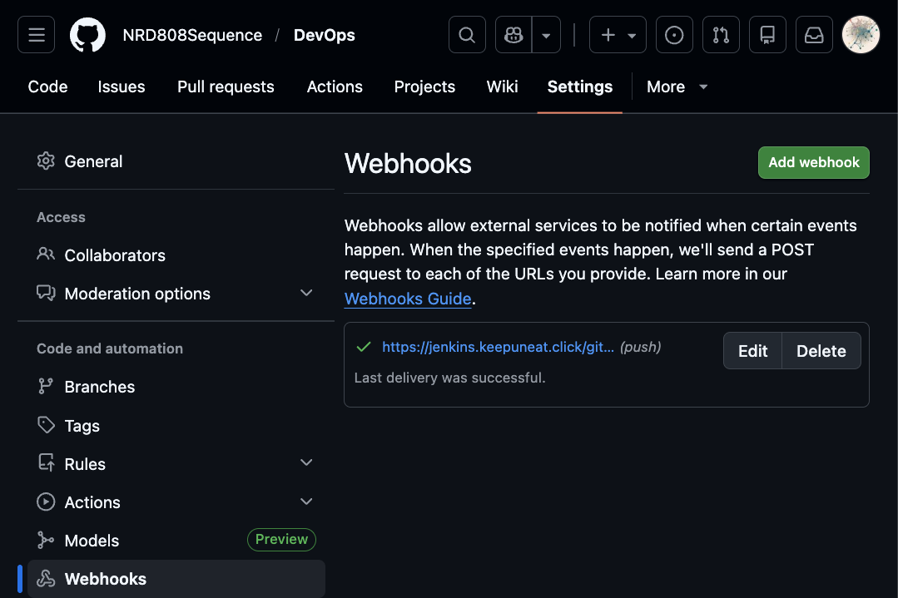

# Lab-2 Jenkins CI/CD Pipeline — Gut Check Report

**Date:** 2026-04-11
**Pipeline:** `vandelay-lab2-pipeline`
**Jenkins:** https://jenkins.keepuneat.click
**Repo:** https://github.com/NRD808Sequence/DevOps (branch: `main`)
**Jenkinsfile Path:** `G-Check/Jenkinsfile`

---

## Build Status Badges

[](https://jenkins.keepuneat.click/job/vandelay-lab2-pipeline/)
[](https://jenkins.keepuneat.click/job/vandelay-lab2-pipeline/)

---

## Build #12 — Clean Idempotent Run

| Field | Value |
|---|---|
| Build | **#12** |
| Result | **SUCCESS** |
| Trigger | GitHub push by `NRD808Sequence` |
| Commit | `6ad48e7b` — *Fix SNS email default — stop subscription replacing on every build* |
| Duration | ~2 min (idempotent — no infrastructure changes) |
| TF Plan | `No changes. Your infrastructure matches the configuration.` |
| TF Apply | `0 added, 0 changed, 0 destroyed` |
| Smoke Test | HTTP 200 on attempt 1 |
| Gate 1 | PASS |
| Gate 2 | PASS |
| Combined Badge | GREEN |

---

## Pipeline Stage View



| Stage | Result | Notes |
|---|---|---|
| Checkout | PASS | branch: `nikrdf-armageddon-branch`, commit: `6ad48e7b` |
| TF Init | PASS | S3 backend: `class7-armagaggeon-tf-bucket` |
| TF Validate | PASS | No syntax errors, no format drift |
| TF Plan | PASS | No changes — infrastructure stable |
| TF Plan (Destroy Preview) | SKIPPED | `DESTROY=false` |
| Approval Gate | SKIPPED | `AUTO_APPROVE=false`, no changes to approve |
| Destroy Approval Gate | SKIPPED | `DESTROY=false` |
| TF Apply | PASS | Applied saved plan — 0 resources changed |
| TF Destroy | SKIPPED | `DESTROY=false` |
| Extract Outputs | PASS | EC2 ID, RDS ID, Jenkins URL, public IP all resolved |
| Smoke Test | PASS | HTTP 200 on first attempt |
| Gate Tests | PASS | BADGE: GREEN — both gates passed |
| Notify | PASS | `Action: DEPLOY — Status: SUCCESS` |
| Post Cleanup | PASS | `.terraform/` removed from workspace |

---

## Jenkins UI Screenshots

### Classic View — Build History


### Blue Ocean View


### Console Output Snippet


### Build Artifacts


### Terraform Plan Output


---

## Gate Test Results — Build #12

### Gate 1: Secrets + EC2 Role — `PASS`



```
PASS: aws sts get-caller-identity succeeded (credentials OK)
PASS: secret exists and is describable (lab/rds/mysql)
PASS: secret rotation enabled (lab/rds/mysql)
PASS: no resource policy found (OK) or not applicable
PASS: instance has IAM instance profile attached
PASS: resolved instance profile -> role (vandelay-instance-profile01 -> vandelay-ec2-role01)
NOTE: caller_arn = assumed-role/vandelay-jenkins-role (pipeline runs as Jenkins IAM role — correct)
```

### Gate 2: Network + RDS — `PASS`



```
PASS: RDS instance exists (vandelay-rds01)
PASS: RDS is not publicly accessible (PubliclyAccessible=False)
PASS: discovered DB port = 3306 (engine=mysql)
PASS: EC2 security groups resolved
PASS: RDS security groups resolved
PASS: RDS SG allows DB port 3306 from EC2 SG (SG-to-SG ingress present)
PASS: RDS subnets show no IGW route (private check OK)
```

### Combined Gate Result



```json
{
  "gate": "all_gates",
  "status": "PASS",
  "badge": { "status": "GREEN" },
  "child_gates": [
    { "name": "secrets_and_role", "exit_code": 0 },
    { "name": "network_db",       "exit_code": 0 }
  ],
  "exit_code": 0
}
```

---

## GitHub Webhook Evidence



- Webhook registered at: `https://github.com/NRD808Sequence/DevOps/settings/hooks`
- Trigger: `push` events on `main` branch
- Jenkins receives via `githubPush()` declarative trigger
- Each push to `main` fires Build automatically — no manual trigger required

---

## Jenkins Pipeline Configuration

| Setting | Value |
|---|---|
| Job type | Declarative Pipeline (from SCM) |
| SCM | `https://github.com/NRD808Sequence/DevOps.git` |
| Branch | `*/main` |
| Jenkinsfile | `G-Check/Jenkinsfile` |
| Webhook trigger | `githubPush()` |
| Concurrency | `disableConcurrentBuilds()` |
| Timeout | 90 minutes |
| Build retention | Last 10 builds + artifacts |
| Credentials | `vandelay-db-password` (Secret Text), `sns-email-endpoint` (Secret Text) |
| Jenkins IAM role | `vandelay-jenkins-role` with `VandelayTerraformDeployPolicy` |
| TF backend | S3 — `class7-armagaggeon-tf-bucket` |
| TF backend key | `class7/fineqts/armageddontf/state-key` |

---

## Security Improvements vs Previous Stack

| Item | Previous (2026-04-05) | Current (2026-04-11) |
|---|---|---|
| Jenkins access | Direct HTTP on port 8080, public IP | HTTPS via ALB — `jenkins.keepuneat.click` |
| Port 8080 | Open to internet | Restricted to ALB SG only |
| SSH (port 22) | Removed earlier | Still removed |
| Shell access | SSM Session Manager only | SSM Session Manager only |
| TLS | None | TLS 1.3 (`ELBSecurityPolicy-TLS13-1-2-2021-06`) |
| Jenkins credential in URL | N/A | Not required — anonymous `Job/Read` for badge only |
| SNS drift | Every build replaced subscription | Fixed — stable default matches deployed value |

---

## Attached Artifacts

| File | Description |
|---|---|
| `gate_result.json` | Combined gate result (GREEN, exit_code=0) |
| `gate_secrets_and_role.json` | Gate 1 detail — Secrets Manager + IAM role |
| `gate_network_db.json` | Gate 2 detail — RDS network isolation |
| `screenshots/` | 16 screenshots covering all pipeline and AWS views |
