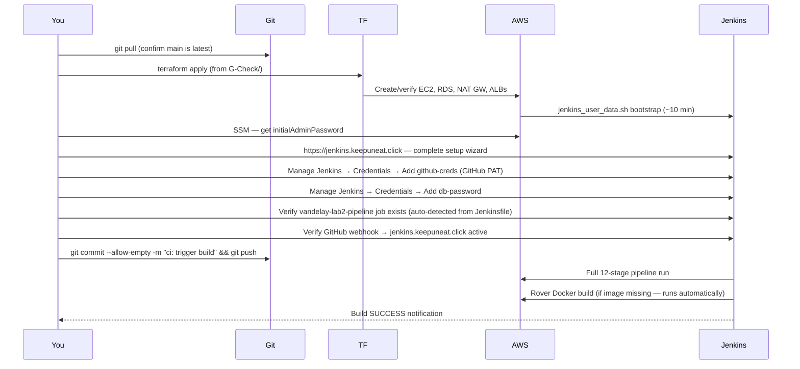

# Vandelay Lab-2 Pipeline — Session Handoff & Infrastructure Reference
**Date:** 2026-04-27
**Last Successful Build:** #33 (2026-04-27 — full 12-stage clean pass)
**Active Repo:** NRD808Sequence/DevOps, branch `main`
**Working Dir:** `/Users/nikosfarias/_M/_TheoWAF/Class7/Armageddon/DevOps/G-Check`
**Jenkins:** https://jenkins.keepuneat.click
**Deliverables Gallery:** http://vandelay-deliverables-212809501772.s3-website-us-east-1.amazonaws.com

---

## Session Summary (2026-04-25 through 2026-04-27)

### What Was Accomplished
- Restructured all deliverables into a single flat folder (`_deliverables/2026-04-25-vandelay-lab2-pipeline/`) removing all dated subfolders from 2026-04-05 through 2026-04-22
- Built a full dark-themed screenshot gallery (`index.html`) covering both pipelines (vandelay-lab2-pipeline + jenkins-s3-test)
- Fixed rover_darkmode.py — identified rover's canvas background as `rgb(244,236,255)` (lavender, not white), applied targeted color replacement for blue-slate dark mode
- Fixed S3 deliverables bucket — images now upload at bucket root (bare filenames) matching index.html src attributes
- Added SVG artifact uploads (`artifacts/rover.svg`, `artifacts/rover_dark.svg`) to S3
- Fixed TF Validate failure caused by deleted `website/index.html` — updated `16-s3-website.tf` to point to new gallery
- Resolved `filemd5()` validate-time failure for `rover.svg` — added gitignore exception and committed artifact
- Added Email from Theodulfo screenshot as class requirement card in gallery
- Build #33: all 12 stages green, both gates PASS, S3 restructure applied cleanly (24 added, 1 changed, 22 destroyed)

### Key Commits This Session
| Hash | Message |
|------|---------|
| `5e785ce` | docs: add Email from Theodulfo card to deliverables index gallery |
| `1a1cae6` | fix(s3): upload PNGs at bucket root + add SVG artifacts to match index.html paths |
| `2be2052` | fix(validate): add rover.svg exception to gitignore + commit artifact |

---

## Credentials Reference

> All stored securely in password manager. Never commit to git.

| Credential | Where Stored | Notes |
|-----------|-------------|-------|
| Jenkins admin password | Password manager | Active login for jenkins.keepuneat.click |
| Jenkins API token | Password manager | `vandelay-cli` token, generated 2026-04-27 |
| GitHub PAT | Password manager | Jenkins credential ID: `github-creds` |
| DB password | AWS Secrets Manager | Auto-persists — see CLI below |

```bash
# Retrieve DB password anytime
aws secretsmanager get-secret-value \
  --secret-id lab/rds/mysql \
  --query SecretString \
  --output text

# Retrieve Jenkins initial password via SSM (if needed)
aws ssm start-session --target i-0ea63c7bf813933c8 --region us-east-1 \
  --document-name AWS-StartInteractiveCommand \
  --parameters 'command=sudo cat /var/lib/jenkins/secrets/initialAdminPassword'

# Trigger build manually (empty commit)
git commit --allow-empty -m "ci: trigger build" && git push origin main

# Trigger build via Jenkins API
curl -X POST https://jenkins.keepuneat.click/job/vandelay-lab2-pipeline/build \
  --user admin:<api-token>
```

---

## Infrastructure Inventory

### Active Resources (us-east-1, account 212809501772)

| Resource | ID | Type | Est. $/month |
|----------|----|------|-------------|
| Jenkins EC2 | i-0ea63c7bf813933c8 | t3.medium | $30 |
| App EC2 | i-05ed1e67ab4e88ed8 | t3.micro | $8 |
| Private Bonus EC2 | i-0d2044851f3ab9a85 | t3.micro | $8 |
| RDS MySQL | vandelay-rds01 | db.t3.micro / 20GB | $15 |
| NAT Gateway | nat-07eee3f20c4efa5a5 | EIP: eipalloc-0e825b651c41252cc | $32 |
| App ALB | vandelay-alb01 | deletion protection ON | $18 |
| Jenkins ALB | vandelay-jenkins-alb | — | $18 |
| WAF | 2 WebACLs (regional + CF) | vandelay-waf01 + vandelay-cf-waf01 | $25 |
| VPC Interface Endpoints | 7 endpoints | SSM/SSMMsg/EC2Msg/SM/KMS/CWLogs/Monitoring | $51 |
| EBS Jenkins Data | vol-04b9c1b1e6f182b3f | Jobs + Credentials + Plugins | $3 |
| CloudFront | E1S240PLQQ8HKJ | dm25gk8mq996u.cloudfront.net | $2 |
| Route53, S3, CloudWatch, SM | misc | — | $8 |
| **TOTAL** | | | **~$218/month** |

### Cost Optimization Opportunities (Future)
| Item | Current | Opportunity | Potential Saving |
|------|---------|-------------|-----------------|
| VPC Interface Endpoints | 7 × $7.30 = $51/mo | Remove non-essential; route through NAT | ~$30/mo |
| NAT Gateway | $32/mo always-on | Schedule shutdown during off-hours | ~$15/mo |
| ALBs | 2 × $18 = $36/mo | Host-based routing on one ALB | ~$18/mo |
| WAF | $25/mo | Review and consolidate rules | ~$5/mo |

### Persistent Resources (Survive Any Terraform Operation)
| Resource | ID/Name | Notes |
|----------|---------|-------|
| TF State Bucket | class7-armagaggeon-tf-bucket | NEVER destroy — remote state |
| Deliverables Bucket | vandelay-deliverables-212809501772 | Public gallery |
| Route53 Hosted Zone | Z07421622AG1WUIDW7VC3 | keepuneat.click |
| ACM Certificate | arn:aws:acm:us-east-1:212809501772:certificate/63ed49ce-... | Wildcard + apex |
| IAM Roles | vandelay-ec2-role01, vandelay-jenkins-role | No cost |
| Secrets Manager | lab/rds/mysql | DB password + rotation |
| SSM Parameters | /vandelay/db/* /lab/db/* | DB endpoint, port, name |
| CloudFront | E1S240PLQQ8HKJ | Points to ALB |

---

## Pipeline Architecture

### 12-Stage Declarative Pipeline

```
Checkout → TF Init → TF Validate → TF Plan → Approval Gate → TF Apply
→ Extract Outputs → Smoke Test → Gate Tests → Rover Image → Rover Graph → Notify
```

### Gate Tests (Both PASS — Build #33)
| Gate | Script | Checks | Result |
|------|--------|--------|--------|
| Gate 1 | `gate_secrets_and_role.sh` | STS identity, Secret exists, IAM profile attached, role resolved | PASS |
| Gate 2 | `gate_network_db.sh` | RDS exists, not publicly accessible, SG-to-SG port 3306 ingress | PASS |

### Key Technical Notes
- Jenkins EC2 protected from Terraform replacement by `lifecycle { ignore_changes = [user_data, ami] }` in `26-jenkins.tf`
- Rover Docker image `rover-tf-1.5.7:latest` pre-built on Jenkins host — rebuilt automatically from `Dockerfile.rover` if missing
- `filemd5()` in `16-s3-website.tf` evaluates at TF Validate time — all referenced files must exist in the repo
- App ALB has `enable_deletion_protection = true` — must disable in TF before `terraform destroy` will succeed
- TF state backend: S3 bucket `class7-armagaggeon-tf-bucket`, remote state, no local `.tfstate`

---

## Re-Spinup Procedure

Use this if Jenkins EC2 is ever terminated and must be rebuilt from scratch.

### Sequence



### Jenkins Reconfiguration Checklist

- [ ] EC2 bootstrap complete — confirm `systemctl status jenkins` active
- [ ] Get initial password via SSM (command in Credentials Reference above)
- [ ] Complete Jenkins setup wizard — install suggested plugins
- [ ] Add credential: `github-creds` → Username with PAT (GitHub PAT)
- [ ] Add credential: `TF_VAR_db_password` → Secret text (DB password from Secrets Manager)
- [ ] Confirm `vandelay-lab2-pipeline` job visible (pulls Jenkinsfile from repo automatically)
- [ ] Check GitHub webhook: `https://jenkins.keepuneat.click/github-webhook/` — Status 200
- [ ] Trigger empty commit build — verify all 12 stages pass
- [ ] Capture fresh screenshots from passing build for any pending placeholders

---

## Key URLs & Endpoints

| Resource | Value |
|----------|-------|
| Jenkins | https://jenkins.keepuneat.click |
| App (CloudFront) | https://app.keepuneat.click |
| App (root domain) | https://keepuneat.click |
| App (direct EC2) | http://44.211.140.210/ |
| Deliverables Gallery | http://vandelay-deliverables-212809501772.s3-website-us-east-1.amazonaws.com |
| GitHub Repo | https://github.com/NRD808Sequence/DevOps |
| RDS Endpoint | vandelay-rds01.cmrys4aosktq.us-east-1.rds.amazonaws.com:3306 |
| Jenkins ALB DNS | vandelay-jenkins-alb-848984987.us-east-1.elb.amazonaws.com |
| VPC | vpc-0036da521c2f5ba73 |

---

## Pending Items (Next Session)

| Item | Priority | Notes |
|------|----------|-------|
| Capture 7 Jenkins screenshots | High | Classic View, Console Output, Build Artifacts, Gate 1, Gate 2, Combined Gate, EC2 list — from next passing build |
| Update index.html placeholders | High | Replace amber cards with real screenshots once captured |
| rover_dark.svg S3 sync | Medium | Pipeline uploads committed version; freshest generated SVG needs manual commit after each Rover Graph run |
| Class repo reports | Done | Filed under `_deliverables/2026-04-27-gut-check/` in class-7-armageddon |
| S3 image path review | Low | `Email from Theodulfo.png` has space in filename — verify browser resolves via URL encoding |
